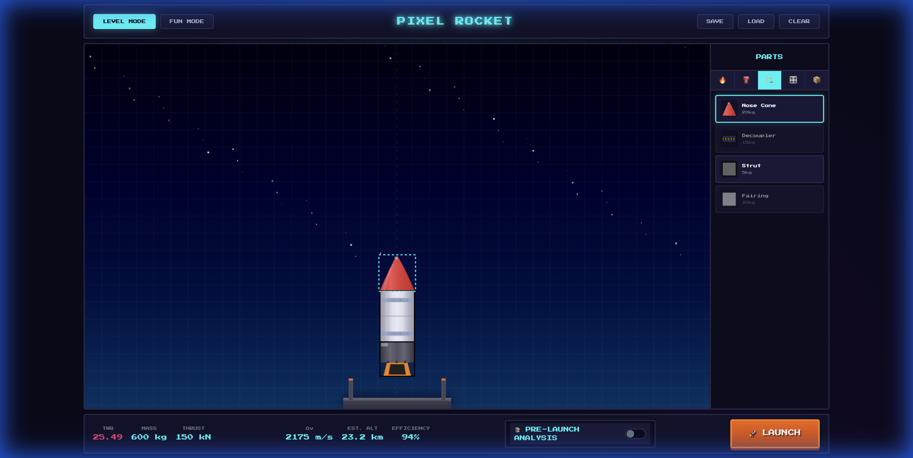
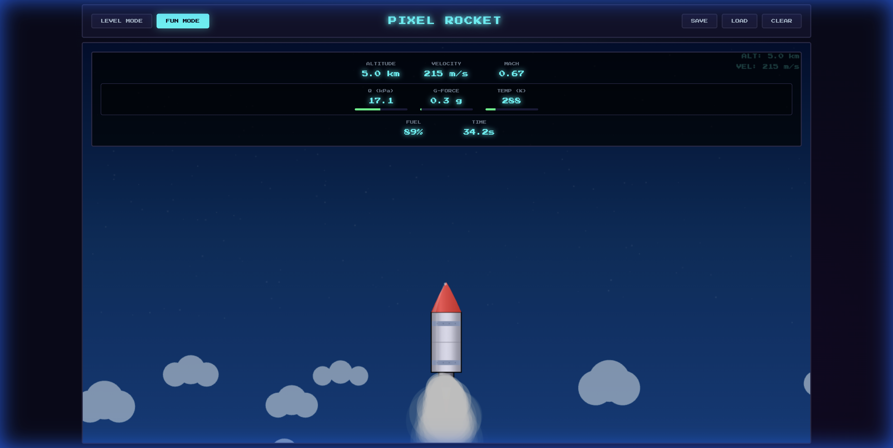
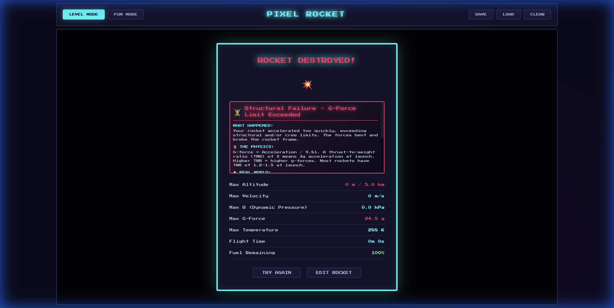

<p align="center">
  
</p>

<h1 align="center">🚀 Pixel Rocket Builder</h1>

<p align="center">
  <b>An educational rocket building and physics simulation game</b><br>
  <i>Build rockets • Learn aerospace engineering • Understand why rockets succeed or fail</i>
</p>

<p align="center">
  
  
  
  
  
</p>

---

## ✨ Features Overview

| Feature | Description |
|---------|-------------|
| 🔧 **Drag & Drop Builder** | Intuitive rocket construction with snap-to-grid |
| 🎮 **Two Game Modes** | Level progression or sandbox creativity |
| 📊 **Real Physics Engine** | ISA atmosphere, Mach regimes, aerodynamic heating |
| 🎓 **Educational Analysis** | Pre-launch warnings and post-flight explanations |
| 💥 **Failure Simulation** | Max Q, G-force, thermal, and impact failures |
| 🔊 **Sound Effects** | Ignition, thrust, staging, explosions |
| 💾 **Save/Load** | Persist your rocket designs |

---

## 🎮 Game Modes

### 🏆 Level Mode
Progress through **10 challenging levels**, each with increasing altitude goals:

| Level | Name | Target Altitude | Unlocked Part |
|-------|------|-----------------|---------------|
| 1 | First Flight | 1,000m | - |
| 2 | Higher Ground | 5,000m | Medium Tank |
| 3 | Boost It | 10,000m | Booster |
| 4 | Sky High | 25,000m | Large Tank |
| 5 | Stratosphere | 50,000m | Heavy Lifter |
| 6 | Edge of Space | 80,000m | Gimbal Mount |
| 7 | **Kármán Line** | 100,000m (SPACE!) | Fairing |
| 8 | Beyond | 150,000m | Reaction Wheel |
| 9 | Low Orbit | 250,000m | - |
| 10 | Orbital | 400,000m | Crew Capsule |

### � Fun Mode
**All parts unlocked!** Build whatever you want:
- Giant multi-engine rockets
- Experimental designs
- Test physics limits
- No restrictions, pure creativity

---

## 🔧 Rocket Building


### Building Interface
- **Parts Panel** (right side) - 5 categories of components
- **Build Canvas** (center) - Drag and position parts
- **Stats Bar** (bottom) - Real-time rocket statistics
- **Launch Button** - Start your mission!

### Build Controls

| Action | How To |
|--------|--------|
| **Add Part** | Click any part in the palette |
| **Move Part** | Drag on the canvas |
| **Delete Part** | Select part + press `Delete` or `Backspace` |
| **Clear All** | Click `CLEAR` button |
| **Save Design** | Click `SAVE` button |
| **Load Design** | Click `LOAD` button |

---

## 🔩 Complete Parts Reference

### 🔥 Engines

| Part | Mass | Thrust | ISP | Fuel Rate | Unlock |
|------|------|--------|-----|-----------|--------|
| **Small Thruster** | 50kg | 20kN | 280s | 2/s | Level 1 |
| **Standard Engine** | 200kg | 150kN | 320s | 15/s | Level 1 |
| **Heavy Lifter** | 500kg | 400kN | 300s | 35/s | Level 5 |
| **Booster** | 300kg | 250kN | 250s | 25/s | Level 3 |

> 💡 **Tip**: Higher ISP = more efficient. Use Standard Engines for best efficiency!

### ⛽ Fuel Tanks

| Part | Mass | Capacity | Size | Unlock |
|------|------|----------|------|--------|
| **Small Tank** | 30kg | 100 | 1×2 | Level 1 |
| **Medium Tank** | 80kg | 300 | 2×3 | Level 2 |
| **Large Tank** | 150kg | 600 | 2×4 | Level 4 |
| **Radial Tank** | 40kg | 80 | 1×2 | Level 6 |

> 💡 **Tip**: Radial tanks attach to the sides for balanced builds!

### 🏗️ Structure

| Part | Mass | Effect | Unlock |
|------|------|--------|--------|
| **Nose Cone** | 20kg | **-30% drag**, better aerodynamics | Level 1 |
| **Decoupler** | 5kg | Enables staging (future feature) | Level 2 |
| **Fairing** | 30kg | **-50% drag**, protects payload | Level 7 |

> ⚠️ **Critical**: Without a nose cone, Max Q failures are much more likely!

### 🎛️ Control

| Part | Mass | Effect | Unlock |
|------|------|--------|--------|
| **Small Fins** | 10kg | +20% stability | Level 1 |
| **Large Fins** | 25kg | +40% stability | Level 4 |
| **Reaction Wheel** | 40kg | 50Nm torque control | Level 8 |
| **Gimbal Mount** | 30kg | 15° thrust vectoring | Level 6 |

### 📦 Payload

| Part | Mass | Value | Unlock |
|------|------|-------|--------|
| **Crew Capsule** | 500kg | 100 pts | Level 10 |
| **Satellite** | 100kg | 50 pts | Level 1 |
| **Cargo Bay** | 50kg | 20 pts | Level 3 |

---

## 📊 Pre-Launch Analysis


Toggle **📚 PRE-LAUNCH ANALYSIS** to see predictions before you launch:

### Risk Assessment
- 🟢 **LOW** - Safe to launch
- 🟡 **MEDIUM** - Some concerns
- 🔴 **HIGH** - Likely failure
- ⚫ **CRITICAL** - Cannot launch

### Warnings Shown
| Warning | Meaning |
|---------|---------|
| **No Engines** | Add an engine to generate thrust |
| **No Fuel** | Add fuel tanks for the engines |
| **TWR < 1** | Rocket won't lift off |
| **Extreme G-Forces** | TWR too high, may break apart |
| **Max Q Risk** | Add nose cone to reduce drag |

### Predictions
- **Predicted Max G** - Expected acceleration stress
- **Predicted Max Q** - Max dynamic pressure
- **Delta-V** - Total velocity change capability
- **Estimated Altitude** - How high you'll go

---

## 🛸 Flight Simulation



### Real-Time Telemetry

| Display | Meaning |
|---------|---------|
| **ALTITUDE** | Height above ground (m/km) |
| **VELOCITY** | Speed (m/s) |
| **MACH** | Speed relative to sound |
| **Q (kPa)** | Dynamic pressure - aerodynamic stress |
| **G-FORCE** | Acceleration in g's |
| **TEMP (K)** | Surface temperature from heating |
| **FUEL** | Remaining propellant % |
| **TIME** | Mission elapsed time |

### Warning Indicators
The Q, G-Force, and Temperature displays have **limit bars**:
- 🟢 **Green** - Safe zone
- 🟡 **Yellow** - Approaching limit (70-90%)
- 🔴 **Red** - Danger zone (90%+), failure imminent!

### Flight Controls

| Control | Action |
|---------|--------|
| **THROTTLE** slider | Adjust engine power 0-100% |
| **STAGE** button | Trigger staging (future) |
| **SKIP** button | Fast-forward to results |
| **ABORT** button | End mission and return to editor |

### Visual Effects
- ☁️ **Clouds** pass by as you ascend
- ⭐ **Stars** appear as you reach space
- 🔥 **Flame** intensity matches throttle
- 💨 **Smoke particles** from engines
- 🌡️ **Heat glow** at high temperatures
- 📳 **Shake effect** during high G-forces

---

## 📈 Results & Learning



### Flight Statistics
- Max Altitude achieved
- Max Velocity reached
- Max Q (dynamic pressure)
- Max G-Force experienced
- Max Temperature reached
- Flight Time
- Fuel Remaining

### Failure Explanations
When your rocket fails, you get **detailed educational feedback**:

| Section | Content |
|---------|---------|
| **💥 What Happened** | Plain-language explanation |
| **📐 The Physics** | Scientific formulas and concepts |
| **🌍 Real World** | NASA, SpaceX comparisons |
| **✅ How to Improve** | Actionable design suggestions |

### Failure Types

| Failure | Cause | Solution |
|---------|-------|----------|
| **Max Q Exceeded** | Too fast in thick atmosphere | Add nose cone, reduce initial throttle |
| **G-Force Limit** | Acceleration too high | Lower TWR, reduce engine power |
| **Thermal Failure** | Surface overheated | Slow down, add heat shields |
| **Crash Landing** | Hit ground too fast | More fuel, controlled descent |

---

## 🔬 Physics Engine

### International Standard Atmosphere (ISA)
Realistic atmospheric modeling:
- **Temperature** decreases with altitude
- **Pressure** drops exponentially
- **Density** affects drag and engine performance

### Mach-Dependent Drag
Different drag coefficients at different speeds:

| Regime | Mach | Drag Behavior |
|--------|------|---------------|
| Subsonic | < 0.8 | Low, steady drag |
| Transonic | 0.8 - 1.2 | **Peak drag** (sound barrier) |
| Supersonic | 1.2 - 5.0 | Lower than transonic |
| Hypersonic | > 5.0 | Heating becomes critical |

### Key Physics Concepts

| Concept | Formula | Game Application |
|---------|---------|------------------|
| **TWR** | Thrust / (Mass × g) | Must be > 1 to lift off |
| **Delta-V** | ISP × g × ln(m₀/mf) | Total velocity change |
| **Max Q** | ½ρv² | Peak aerodynamic stress |
| **G-Force** | Acceleration / 9.81 | Structural limits |

### Failure Thresholds
| Limit | Value | Consequence |
|-------|-------|-------------|
| Max Q | 35 kPa | Structural breakup |
| G-Force | 10 g | Frame/payload damage |
| Temperature | 1500 K | Thermal failure |
| Landing | 10 m/s | Crash on impact |

---

## ⌨️ All Controls

### Keyboard
| Key | Action |
|-----|--------|
| `Delete` / `Backspace` | Remove selected part |
| `↑` Arrow | Increase throttle (flight) |
| `↓` Arrow | Decrease throttle (flight) |

### Mouse
| Action | Effect |
|--------|--------|
| **Click part** | Add to rocket |
| **Drag part** | Reposition |
| **Click category tab** | Switch part type |

---

## 💾 Save System

### Auto-Saved Data
- Current level progress
- Maximum unlocked level
- Unlocked parts list
- Educational toggle preference

### Rocket Designs
Click **SAVE** to store your current design to `localStorage`.
Click **LOAD** to restore your saved rocket.

---

## 🛠️ Technical Details

### Tech Stack
- **Pure HTML5/CSS/JavaScript** - No frameworks
- **Canvas 2D API** - Rendering
- **LocalStorage API** - Persistence
- **Web Audio API** - Sound effects

### Browser Support
| Browser | Status |
|---------|--------|
| Chrome | ✅ Full support |
| Firefox | ✅ Full support |
| Safari | ✅ Full support |
| Edge | ✅ Full support |

### Project Structure
```
SpaceSim/
├── index.html          # Main game file
├── css/
│   └── styles.css      # All styling (pixel art theme)
├── js/
│   ├── main.js         # Game controller, levels, animation
│   ├── editor.js       # Rocket builder interface
│   ├── physics.js      # Full physics simulation
│   ├── parts.js        # All part definitions & rendering
│   └── audio.js        # Sound effects system
└── assets/
    └── screenshots/    # Documentation images
```

---

## 🎯 For Educators

This game teaches through **experiential learning**:

### Curriculum Connections

| Subject | Concepts Covered |
|---------|-----------------|
| **Physics** | Newton's Laws, gravity, acceleration, forces |
| **Engineering** | Design trade-offs, structural limits, efficiency |
| **Aerospace** | Atmosphere, drag, heating, orbital mechanics basics |
| **Math** | Ratios (TWR), logarithms (Delta-V), calculus (physics) |

### Classroom Activities
1. **Design Challenge**: Reach 10km with minimal fuel
2. **Failure Analysis**: Deliberately cause each failure type
3. **Optimization**: Best Delta-V for fixed mass budget
4. **Real World Comparison**: Match your results to SpaceX data

### Learning Progression
1. Build a simple rocket → Understand TWR
2. Add nose cone → Learn about drag
3. Cause Max Q failure → Understand atmospheric stress
4. Reach space → Celebrate the Kármán line!

---

## 🚀 Quick Start

1. **Open** `index.html` in any modern browser
2. **Add** a Small Thruster (🔥 tab)
3. **Add** a Small Tank (⛽ tab)
4. **Check** TWR > 1.0 at the bottom
5. **Click** 🚀 LAUNCH
6. Watch your rocket fly!

---

## 📸 Screenshots

<p align="center">
  
  
</p>
<p align="center">
  
  
</p>

---

<p align="center">
  <b>Built with ❤️ for space enthusiasts and future aerospace engineers</b>
</p>

<p align="center">
  <i>🌟 Star this repo if you found it educational!</i>
</p>