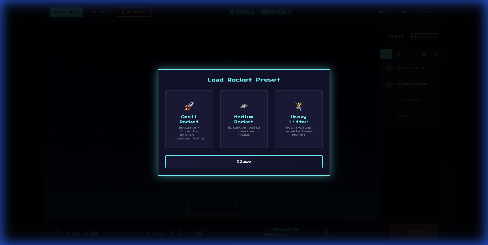
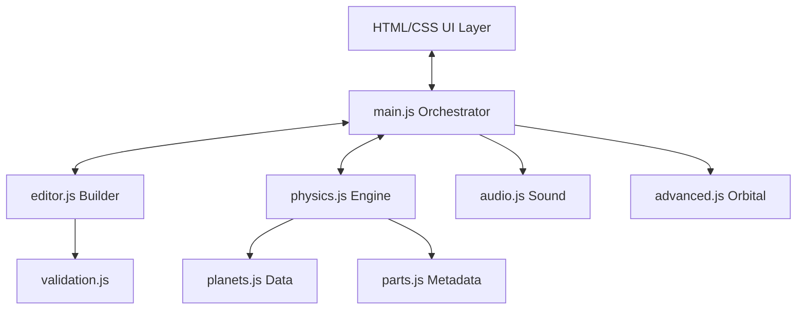
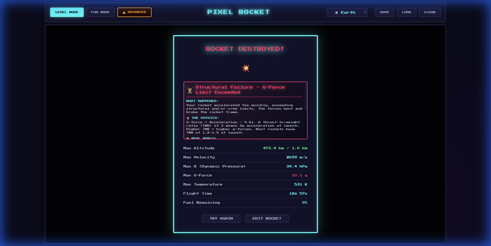

  

# 🚀 Pixel Rocket Builder

  
  
  
  
  

### **A browser-based Kerbal Space Program built from scratch in vanilla JavaScript.**

## ⚡ Quick Summary
- **Built from scratch**: Hand-coded rocket simulator using zero external libraries or frameworks.
- **Realistic Physics**: Real-time ISA atmospheric modeling, Mach-dependent drag, and orbital mechanics.
- **Advanced Engineering**: Modular part system with graph-based staging validation and structural checks.
- **Educational Impact**: Dynamic failure modeling and pre-launch analysis to teach aerospace principles.

### **[Live Demo](https://garvitsinghal1.github.io/Pixel-Rocket-Builder/)** | **[Technical Deep Dive](#-deep-physics-engine)** | **[Engineering Challenges](#-engineering-challenges--lessons)**

---

## 🧰 Tech Stack
- **Vanilla JavaScript** (ES6+)
- **HTML5 Canvas** (High-frequency rendering)
- **CSS3** (Modern layout and UI tokens)
- **Web Audio API** (Procedural sound synthesis)
- **LocalStorage** (Rocket design persistence)

---

## 🛠️ Technical Highlights
*   **High-Fidelity Physics**: Custom-built engine featuring **ISA (International Standard Atmosphere)** modeling, Mach-dependent drag curves, and aerodynamic heating (Stagnation & Radiation).
*   **Orbital Mechanics**: Real-time integration of state vectors for **Keplerian orbital elements** (Apoapsis, Periapsis, Eccentricity) in 2D space.
*   **Dynamic Component Graph**: A BFS-based connectivity system handles complex staging, structural integrity validation, and debris generation.
*   **Stochastic Failure Modeling**: Simulation of real-world risks including **Ignition Failures** and **Fuel Pump Cavitation** based on environmental pressure.
*   **Performance First**: Zero-dependency architecture with **Object Pooling** and **RK4-like integration** sub-stepping for simulation stability at 60 FPS.

---

## 💼 For Recruiters: Technical Summary
> **Resume Highlight:**
> Designed and implemented a browser-based rocket simulation engine with ISA atmospheric modeling, Mach-dependent drag, orbital mechanics, and real-time telemetry, using vanilla JavaScript and HTML5 Canvas. Implemented graph-based staging validation, stochastic failure models, and performance optimizations including sub-stepped integration and object pooling.

---

## ✨ Features Overview

| Feature | Description |
|---------|-------------|
| 🔧 **Drag & Drop Builder** | Intuitive rocket construction with snap-to-grid |
| 🚀 **Rocket Presets** | Quick-start templates for immediate launching |
| 🎮 **Three Game Modes** | Level progression, sandbox, or realistic simulation |
| 📊 **Real Physics Engine** | ISA atmosphere, Mach regimes, aerodynamic heating |
| 🎓 **Educational Analysis** | Pre-launch warnings and post-flight explanations |
| 💥 **Failure Simulation** | Max Q, G-force, thermal, and impact failures |
| 🔊 **Sound Effects** | Ignition, thrust, staging, explosions |
| 💾 **Save/Load** | Persist your rocket designs |

---

## 🎮 Game Modes

### 🏆 Level Mode
Progress through **10 challenging levels**, each with increasing altitude goals:

| Level | Name | Target Altitude | Unlocked Part |
|-------|------|-----------------|---------------|
| 1 | First Flight | 1,000m | - |
| 2 | Higher Ground | 5,000m | Medium Tank |
| 3 | Boost It | 10,000m | Booster |
| 4 | Sky High | 25,000m | Large Tank |
| 5 | Stratosphere | 50,000m | Heavy Lifter |
| 6 | Edge of Space | 80,000m | Gimbal Mount |
| 7 | **Kármán Line** | 100,000m (SPACE!) | Fairing |
| 8 | Beyond | 150,000m | Reaction Wheel |
| 9 | Low Orbit | 250,000m | - |
| 10 | Orbital | 400,000m | Crew Capsule |

### 🎨 Fun Mode
**All parts unlocked!** Build whatever you want:
- Giant multi-engine rockets
- Experimental designs
- Test physics limits
- No restrictions, pure creativity

### ⚠️ Advanced Mode

> **⛔ NOT RECOMMENDED FOR NON-EXPERTS**

For players who want **realistic orbital mechanics** and **simulation-level physics**:

#### Realistic Physics Features
| Feature | Description |
|---------|-------------|
| 🛰️ **Keplerian Orbits** | True orbital mechanics with apoapsis/periapsis |
| 📍 **Orbital Tracking** | Ap/Pe altitude display during flight |
| 🌍 **Multi-Body Physics** | Earth, Moon, Mars with unique atmospheres |
| 🔄 **SOI Transitions** | Sphere of Influence calculations |

#### Engine Simulation
| Feature | Description |
|---------|-------------|
| 📉 **ISP vs Altitude** | Engine efficiency changes with atmosphere |
| ⏱️ **Throttle Lag** | 0.5s response time for throttle changes |
| 💥 **Ignition Failures** | 5-20% chance of engine start failure |
| 🌀 **Fuel Cavitation** | Pump issues at low fuel pressure |

#### Planetary System
| Body | Surface Gravity | Atmosphere | Scale Height |
|------|-----------------|------------|--------------|
| 🌍 **Earth** | 9.81 m/s² | Yes (100km) | 8,500m |
| 🌑 **Moon** | 1.62 m/s² | None | - |
| 🔴 **Mars** | 3.72 m/s² | Thin (125km) | 11,100m |

---

## 🚀 Rocket Building

### Building Interface
- **Parts Panel** (right side) - 5 categories of components
- **Build Canvas** (center) - Drag and position parts
- **Stats Bar** (bottom) - Real-time rocket statistics
- **Launch Button** - Start your mission!

### Build Controls

| Action | How To |
|--------|--------|
| **Add Part** | Click any part in the palette |
| **Move Part** | Drag on the canvas |
| **Delete Part** | Select part + press `Delete` or `Backspace` |
| **Clear All** | Click `CLEAR` button |
| **Save Design** | Click `SAVE` button |
| **Load Design** | Click `LOAD` button |

### 🚀 Quick Load Presets

Don't want to build from scratch? Click **PRESETS** to choose a pre-designed rocket:
- **Small Rocket** - Simple, sub-orbital hopper
- **Medium Rocket** - robust multi-stage vehicle
- **Heavy Lifter** - Massive rocket for deep space

---

## 🔩 Complete Parts Reference

### 🔥 Engines

| Part | Mass | Thrust | ISP | Fuel Rate | Unlock |
|------|------|--------|-----|-----------|--------|
| **Small Thruster** | 50kg | 20kN | 280s | 2/s | Level 1 |
| **Standard Engine** | 200kg | 150kN | 320s | 15/s | Level 1 |
| **Heavy Lifter** | 500kg | 400kN | 300s | 35/s | Level 5 |
| **Booster** | 300kg | 250kN | 250s | 25/s | Level 3 |

> 💡 **Tip**: Higher ISP = more efficient. Use Standard Engines for best efficiency!

### ⛽ Fuel Tanks

| Part | Mass | Capacity | Size | Unlock |
|------|------|----------|------|--------|
| **Small Tank** | 30kg | 100 | 1×2 | Level 1 |
| **Medium Tank** | 80kg | 300 | 2×3 | Level 2 |
| **Large Tank** | 150kg | 600 | 2×4 | Level 4 |
| **Radial Tank** | 40kg | 80 | 1×2 | Level 6 |

> 💡 **Tip**: Radial tanks attach to the sides for balanced builds!

### 🏗️ Structure

| Part | Mass | Effect | Unlock |
|------|------|--------|--------|
| **Nose Cone** | 20kg | **-30% drag**, better aerodynamics | Level 1 |
| **Decoupler** | 5kg | Enables staging (future feature) | Level 2 |
| **Fairing** | 30kg | **-50% drag**, protects payload | Level 7 |

> ⚠️ **Critical**: Without a nose cone, Max Q failures are much more likely!

### 🎛️ Control

| Part | Mass | Effect | Unlock |
|------|------|--------|--------|
| **Small Fins** | 10kg | +20% stability | Level 1 |
| **Large Fins** | 25kg | +40% stability | Level 4 |
| **Reaction Wheel** | 40kg | 50Nm torque control | Level 8 |
| **Gimbal Mount** | 30kg | 15° thrust vectoring | Level 6 |

### 📦 Payload

| Part | Mass | Value | Unlock |
|------|------|-------|--------|
| **Crew Capsule** | 500kg | 100 pts | Level 10 |
| **Satellite** | 100kg | 50 pts | Level 1 |
| **Cargo Bay** | 50kg | 20 pts | Level 3 |

---

## 📊 Pre-Launch Analysis

Toggle **📚 PRE-LAUNCH ANALYSIS** to see predictions before you launch:

### Risk Assessment
- 🟢 **LOW** - Safe to launch
- 🟡 **MEDIUM** - Some concerns
- 🔴 **HIGH** - Likely failure
- ⚫ **CRITICAL** - Cannot launch

### Warnings Shown
| Warning | Meaning |
|---------|---------|
| **No Engines** | Add an engine to generate thrust |
| **No Fuel** | Add fuel tanks for the engines |
| **TWR < 1** | Rocket won't lift off |
| **Extreme G-Forces** | TWR too high, may break apart |
| **Max Q Risk** | Add nose cone to reduce drag |

### Predictions
- **Predicted Max G** - Expected acceleration stress
- **Predicted Max Q** - Max dynamic pressure
- **Delta-V** - Total velocity change capability
- **Estimated Altitude** - How high you'll go

---

## 🛸 Flight Simulation

### Real-Time Telemetry

| Display | Meaning |
|---------|---------|
| **ALTITUDE** | Height above ground (m/km) |
| **VELOCITY** | Speed (m/s) |
| **MACH** | Speed relative to sound |
| **Q (kPa)** | Dynamic pressure - aerodynamic stress |
| **G-FORCE** | Acceleration in g's |
| **TEMP (K)** | Surface temperature from heating |
| **FUEL** | Remaining propellant % |
| **TIME** | Mission elapsed time |

### Warning Indicators
The Q, G-Force, and Temperature displays have **limit bars**:
- 🟢 **Green** - Safe zone
- 🟡 **Yellow** - Approaching limit (70-90%)
- 🔴 **Red** - Danger zone (90%+), failure imminent!

### Flight Controls

| Control | Action |
|---------|--------|
| **THROTTLE** slider | Adjust engine power 0-100% |
| **STAGE** button | Trigger staging (future) |
| **SKIP** button | Fast-forward to results |
| **ABORT** button | End mission and return to editor |

---

## 🏗️ System Architecture

Pixel Rocket Builder is a modular JavaScript application designed for performance and educational clarity.

### Module Responsibilities
- **`main.js`**: Central orchestrator. Manages the state machine (Editor -> Launch -> Results) and the primary simulation loop.
- **`physics.js`**: The core Newtonian engine. Handles force integration, atmospheric modeling, and aerodynamic effects.
- **`editor.js`**: Manages the construction grid, part snapping, and rocket persistence.
- **`advanced.js`**: Extends the physics engine with Keplerian orbital mechanics and stochastic failure models.
- **`validation.js`**: Enforces structural and logical constraints (e.g., blocked exhausts, TWR limits).

---

## 🔬 Deep Physics Engine

The simulation uses a high-fidelity model based on real-world aerospace principles.

### 1. Newtonian Integration
The rocket's state is updated every frame using:
$$F_{net} = \vec{F}_{thrust} + \vec{F}_{gravity} + \vec{F}_{drag}$$
$$a = \frac{F_{net}}{m_{total}}$$

### 2. Atmospheric & Aerodynamic Modeling
We implement the **International Standard Atmosphere (ISA)** to model density changes:
- **Lapse Rate:** Inside the troposphere ($h \le 11km$), temperature drops linearly: $T = 288.15 - 0.0065 \times h$.
- **Mach-Dependent Drag:** The Drag Coefficient ($C_d$) is not constant. It scales based on the Mach number ($M$):
    - **Subsonic ($M < 0.8$):** Base $C_d$
    - **Transonic ($0.8 \le M < 1.2$):** Rapid rise modeling the "sound barrier" shockwave.
    - **Supersonic ($M \ge 1.2$):** Gradual decay as $1/\sqrt{M}$.
- **Dynamic Pressure ($Q$):** $Q = \frac{1}{2} \rho v^2$. This determines structural stress (Max Q).

### 3. Thermal Simulation
Aerodynamic heating is modeled using stagnation point physics:
- **Stagnation Temp ($T_{stag}$):** $T_{stag} = T_{ambient} \times (1 + 0.2 \times M^2)$ (assuming $\gamma = 1.4$).
- **Radiative Cooling:** The hull cools according to the **Stefan-Boltzmann law**: $P_{rad} = \epsilon \sigma A T^4$.

### 4. Staging & Connectivity
The rocket is treated as a **Connectivity Graph**.
- **BFS Search:** When a stage is triggered, a Breadth-First Search starts from the **Root Part** (Command Pod or Probe).
- **Disconnected Components:** Any parts no longer reachable from the Root are tagged for separation and converted into physical debris.

---

## 🛰️ Advanced Mode Simulation

Advanced mode introduces professional-grade flight dynamics.

### Orbital Mechanics
When active, the simulation tracks state vectors relative to the planetary center:
- **Orbital Elements:** Calculates Semi-major Axis ($a$), Eccentricity ($e$), and Apoapsis/Periapsis altitudes.
- **Velocity Thresholds:** 
    - **Circular Velocity:** $v_c = \sqrt{\frac{GM}{r}}$
    - **Escape Velocity:** $v_e = \sqrt{\frac{2GM}{r}}$

### Complex Engine Dynamics
- **Altitude-Adjusted ISP:** Engine efficiency ($I_{sp}$) varies linearly with atmospheric pressure between $I_{sp,sea}$ and $I_{sp,vac}$.
- **Stochastic Failures:** 
    - **Ignition Failure:** 5-20% chance of failure if fuel pressure is low during engine start.
    - **Cavitation:** High flow rates at low tank pressures can cause "vapor lock," resulting in thrust oscillation.
- **Throttle Response:** Engines have a 0.5s time constant, preventing instantaneous thrust changes.

---

## 📐 Design Validation Rules

The `validation.js` module enforces several strictly "blocked" conditions:

1. **Blocked Exhaust:** Parts placed directly below an engine nozzle will cause a failure (exhaust must be clear).
2. **Structural Support:** Every part must be supported from below or via side-attach points (no floating parts).
3. **Upside-Down Check:** If a nose cone is placed below an engine, the rocket is flagged as unlaunchable.
4. **Connectivity Check:** Only parts connected to the main stack contribute to thrust and mass calculations.

---

## 📐 Engineering Challenges & Lessons

### **The "Tunneling" Problem**
*   **Challenge:** At high velocities (e.g., re-entry at 5,000 m/s), the rocket would often "skip" through atmospheric layers or even the ground during a single frame update.
*   **Solution:** Implemented **Temporal Sub-stepping**. The physics engine runs multiple integration steps per visual frame, ensuring higher precision for collision and thermal calculations without sacrificing UI performance.

### **Robust Staging Logic**
*   **Challenge:** A simple BFS connectivity check failed when players created complex overlapping designs or loops.
*   **Solution:** Developed a multi-pass validation system. The engine first performs a graph search to find reachable parts from the root, then applies a **Geometric Force Fallback**—parts physically separated by a firing decoupler are forcibly detached to ensure intuitive gameplay.

### **UI/Simulation Sync**
*   **Challenge:** Rendering complex telemetry and part animations at 60 FPS while running a high-fidelity simulator.
*   **Solution:** Utilized **Canvas Double-Buffering** and **Object Pooling** for the particle system (smoke/fire), minimizing Garbage Collection (GC) pauses during critical flight phases.

---

## ⚡ Performance Optimization

- **Fixed Time-Step:** The physics engine uses a RK4-like integration sub-stepping to maintain accuracy at high velocities.
- **Object Pooling:** Smoke and exhaust particles are recycled to minimize garbage collection pauses.
- **Canvas Rendering:** Uses a double-buffered canvas approach for smooth 60 FPS flight visualization even during heavy staging events.

---

## 📸 Technical Showcase

| Editor View | Flight Telemetry | Mission Results |
| :--- | :--- | :--- |
|  |  |  |

---

  <b>Built for space enthusiasts and future engineers.</b> 
  <i>🌟 Star the repo if you found the physics implementation interesting!</i>

