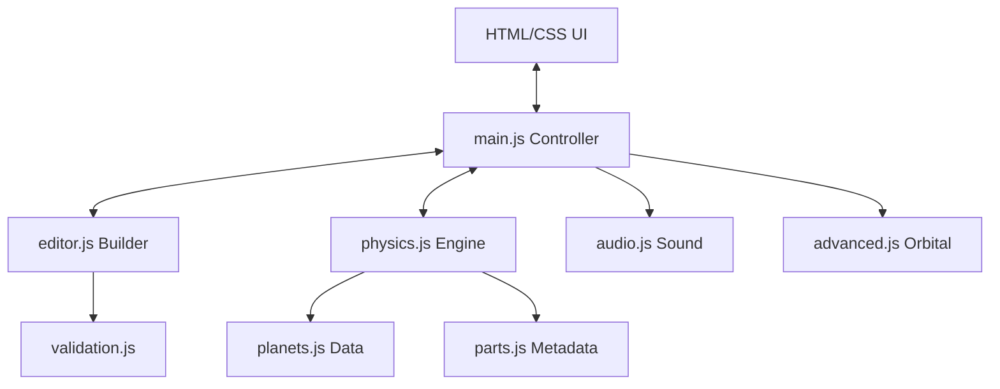

# Pixel Rocket Builder - Technical Documentation

## 🏗️ Architecture Overview

The simulation is built as a modular JavaScript application, separating UI logic, physics calculations, and state management.



### Core Modules
- **`main.js`**: Orchestrates the game loop, screen transitions, and global state.
- **`physics.js`**: Implements the aerodynamic and Newtonian physics engine.
- **`editor.js`**: Handles the drag-and-drop rocket building interface.
- **`planets.js`**: Contains atmospheric and gravitational data for Earth, Moon, and Mars.
- **`advanced.js`**: (Advanced Mode) Implements Keplerian orbital mechanics and complex engine simulation.

---

## 🚀 Physics Engine

The simulation uses a high-fidelity physics model suitable for educational purposes.

### 1. Newtonian Motion
The rocket's motion is governed by:
$$F_{net} = F_{thrust} + F_{gravity} + F_{drag}$$
$$a = \frac{F_{net}}{m_{total}}$$

### 2. Gravity Model
Gravity follows the inverse-square law:
$$g = g_0 \times \left(\frac{R}{R + h}\right)^2$$
Where $g_0$ is surface gravity, $R$ is planet radius, and $h$ is altitude.

### 3. Atmospheric Model (ISA)
Air density $\rho$ is calculated based on temperature and pressure lapse rates:
- **Temperature ($T$):** $T = T_{sea} - (L \times h)$
- **Pressure ($P$):** $P = P_{sea} \times (1 - \frac{L \times h}{T_{sea}})^{\frac{g \times M}{R \times L}}$
- **Density ($\rho$):** $\rho = \frac{P \times M}{R \times T}$

### 4. Aerodynamics
**Drag Force:**
$$F_{drag} = \frac{1}{2} \rho v^2 C_d A$$
- **$C_d$ (Drag Coefficient):** Modeled as a function of Mach number, accounting for subsonic, transonic, and supersonic regimes.
- **$A$ (Cross-sectional Area):** Calculated dynamically based on the rocket's widest part.

**Aerodynamic Heating:**
Stagnation temperature is calculated to simulate re-entry heating:
$$T_{stag} = T_{ambient} \times \left(1 + \frac{\gamma - 1}{2} M^{2}\right)$$

### 5. Rocket Equations
- **Delta-V ($\Delta V$):** $I_{sp} \times g_0 \times \ln\left(\frac{m_{wet}}{m_{dry}}\right)$
- **TWR (Thrust-to-Weight Ratio):** $\frac{F_{thrust}}{m_{total} \times g}$

---

## 📸 Screenshots

````carousel

<!-- slide -->

<!-- slide -->

````

---

## ⚡ Performance Notes

- **Simulation Loop:** The physics engine runs at a fixed time step ($dt$) inside a `requestAnimationFrame` loop, ensuring stability across different refresh rates.
- **Staging Logic:** Staging uses a **Breadth-First Search (BFS)** on the part connectivity graph. This allows for complex, multi-stack designs where disconnecting a center decoupler correctly drops all child parts while keeping side boosters attached.
- **Rendering:** Uses HTML5 Canvas for both the Editor and Launch screens. Particle systems (smoke/fire) are optimized using object pooling to prevent GC spikes during high-thrust phases.
- **Collision Detection:** Lightweight Axis-Aligned Bounding Box (AABB) checks are used between parts during assembly to maintain high performance in the editor.
